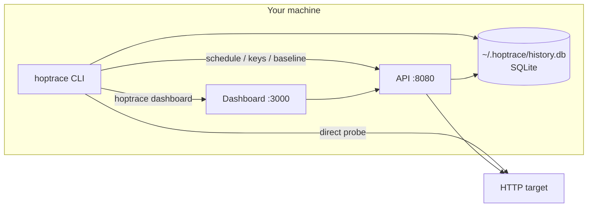
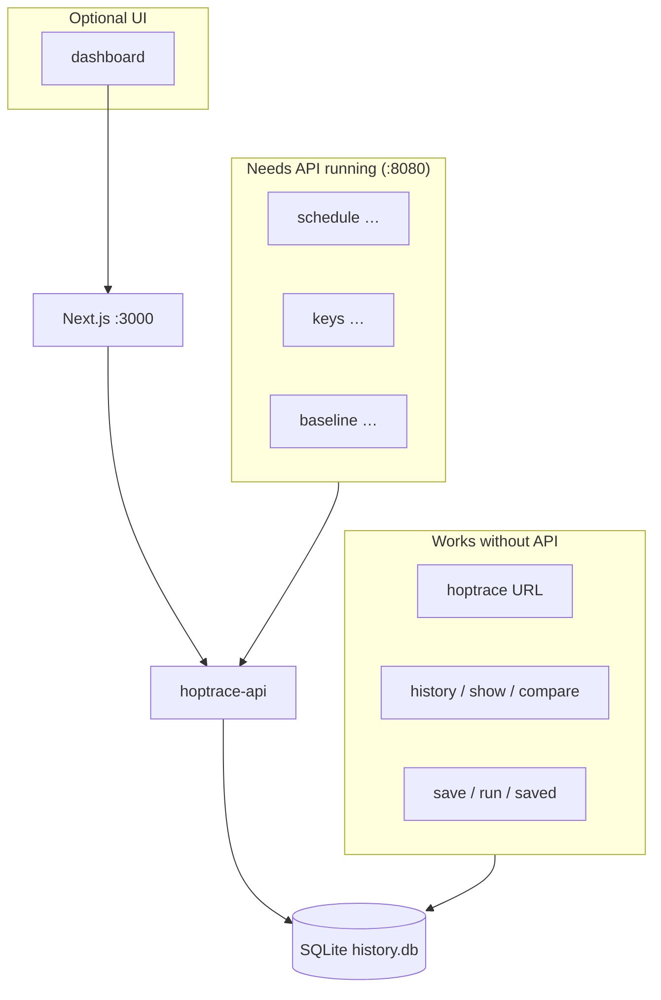
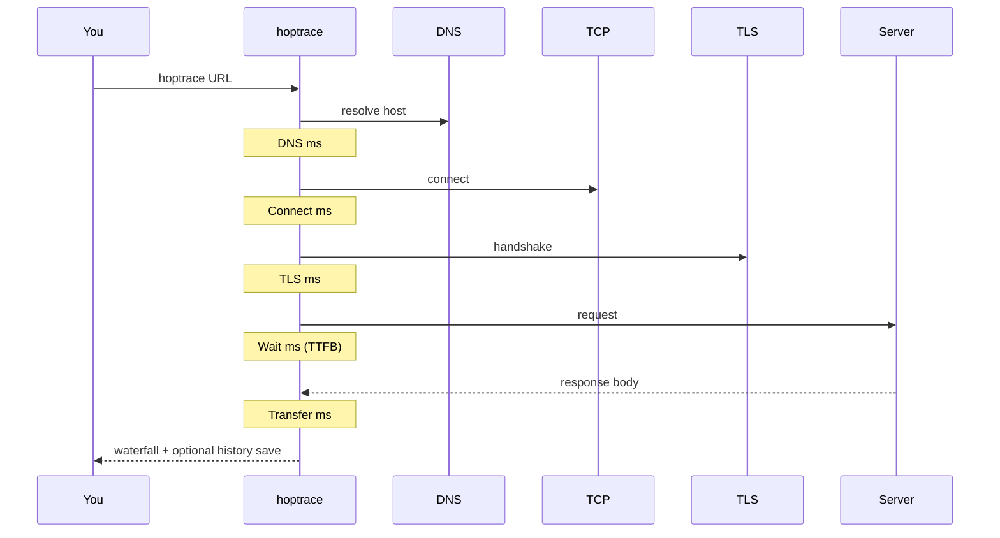
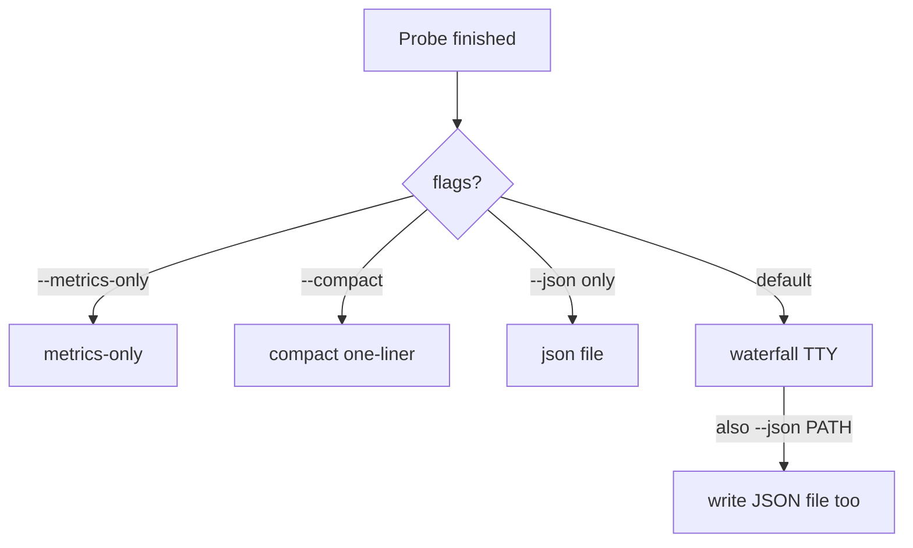
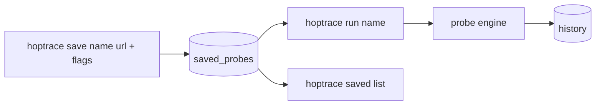
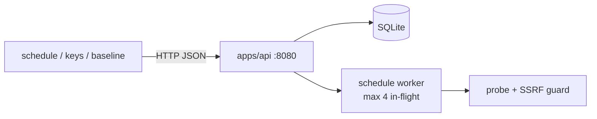
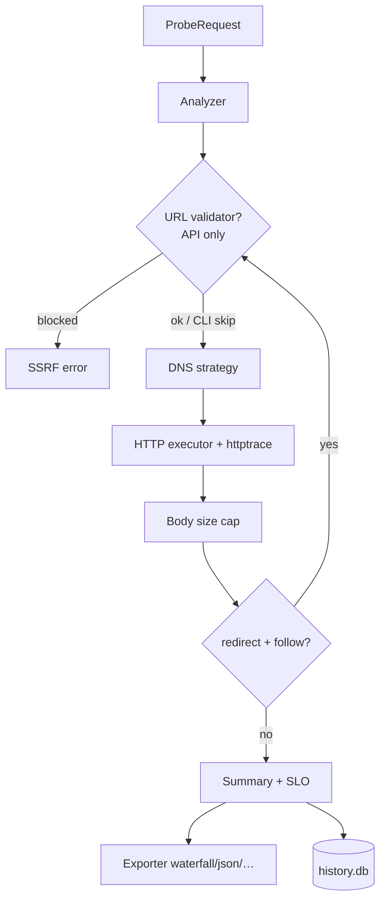

# Hoptrace guide

Complete reference for the **hoptrace** CLI and local stack: probes, history, library, schedules, keys, baselines, dashboard, env vars, and scripting.



Hoptrace is a **single-tenant local tool** (one SQLite DB per machine). See [SECURITY.md](SECURITY.md) for SSRF, auth, and tenancy details.

---

## Table of contents

1. [Install](#install)
2. [Mental model](#mental-model)
3. [Quick start](#quick-start)
4. [Probe a URL](#probe-a-url)
5. [Probe flags](#probe-flags)
6. [Output modes](#output-modes)
7. [History](#history)
8. [Saved probes (library)](#saved-probes-library)
9. [Dashboard](#dashboard)
10. [API-backed commands](#api-backed-commands)
11. [Schedules](#schedules)
12. [API keys](#api-keys)
13. [Baselines](#baselines)
14. [Environment variables](#environment-variables)
15. [Exit codes](#exit-codes)
16. [Shell completions](#shell-completions)
17. [Running the API](#running-the-api)
18. [How a probe works](#how-a-probe-works)
19. [Testing features](#testing-features)
20. [Command cheat sheet](#command-cheat-sheet)

---

## Install

```bash
git clone <repo> && cd hoptrace
make install          # builds CLI → ~/.local/bin/hoptrace (+ hoptrace-api in bin/)
```

Or after publish:

```bash
go install github.com/sandeepv/hoptrace/apps/cli@latest
```

Cross-compiled binaries: tag a `v*` release, or locally `make release` → `dist/`.

Check it:

```bash
hoptrace version
```

---

## Mental model



| Mode | What you need |
|------|----------------|
| CLI probes + history + library | Just the `hoptrace` binary |
| Schedules, keys, baselines | `make api` (or `make dev`) |
| Web waterfall / share links | `make dev` then `hoptrace dashboard` |

---

## Quick start

```bash
# One-shot probe (waterfall in the terminal)
hoptrace 'https://httpbin.io/get'

# Save & re-run
hoptrace save demo 'https://httpbin.io/get'
hoptrace run demo
hoptrace history

# Full local stack
pnpm install
make install
make dev                 # API :8080 + web :3000
hoptrace dashboard       # opens the UI
```

---

## Probe a URL

```bash
hoptrace 'https://example.com'
hoptrace probe 'https://example.com'    # same thing
```

Every successful run (unless `--no-save`) is written to `~/.hoptrace/history.db` and prints `saved history id=…` on stderr.

### What you see

The default TTY output is a **waterfall**: DNS → Connect → TLS → Wait → Transfer, plus status, bytes, and cert summary when present.



---

## Probe flags

These flags work on `hoptrace [url]`, `hoptrace probe`, `hoptrace save`, and `hoptrace run` (run merges saved template + flag overrides).

| Flag | Short | Default | Purpose |
|------|-------|---------|---------|
| `--method` | `-X` | `GET` | HTTP method |
| `--header` | `-H` | — | Header (`Key: Value`), repeatable |
| `--data` | `-d` | — | Body string, or `@path/to/file` |
| `--follow` | `-L` | off | Follow redirects |
| `--timeout` | `-m` | `30` | Timeout (seconds) |
| `--proxy` | `-x` | env proxy | Proxy URL; empty string disables env proxy |
| `--ignore-ssl` | `-k` | off | Skip TLS verification |
| `--cacert` | | — | Custom CA bundle path |
| `--compact` | | off | One-line summary |
| `--metrics-only` | | off | Script-friendly metrics |
| `--json` | | — | Write JSON report to path |
| `--slo` | | — | Thresholds, e.g. `total=500,ttfb=200` |
| `--no-save` | | off | Do not write this run to history |
| `--max-body` | | `10485760` (10 MiB) | Max response body bytes to read |
| `--verbose` | `-v` | off | Debug logs on stderr (persistent) |

### Examples

```bash
# Custom method + headers + body
hoptrace -X POST -H 'Content-Type: application/json' \
  -d '{"ping":true}' 'https://httpbin.io/post'

# Body from file
hoptrace -X PUT -d @./payload.json 'https://httpbin.io/put'

# Follow redirects, tight timeout
hoptrace -L -m 5 'https://httpbin.io/redirect/3'

# SLO gate (exit 4 on fail)
hoptrace --slo total=500,ttfb=200 'https://httpbin.io/get'

# Cap body read (memory guard)
hoptrace --max-body 1048576 'https://example.com/'

# Skip history + scripting output
hoptrace --no-save --metrics-only 'https://httpbin.io/get'

# JSON report file (and still print waterfall unless --metrics-only/--compact)
hoptrace --json /tmp/report.json 'https://httpbin.io/get'

# Self-signed / custom CA
hoptrace -k 'https://localhost:8443/'
hoptrace --cacert ./corp-ca.pem 'https://internal.example/'
```

### Color

| Setting | Effect |
|---------|--------|
| Interactive TTY | Color phase bars on |
| `HOPTRACE_COLOR=1` | Force color |
| `NO_COLOR=1` | Force off |

---

## Output modes



| Mode | How | Best for |
|------|-----|----------|
| Waterfall | default | Humans in a terminal |
| Compact | `--compact` | Quick glance |
| Metrics-only | `--metrics-only` | Scripts / CI |
| JSON | `--json path` | Parsers / archives |

---

## History

Local SQLite — **no API required**.

```bash
hoptrace history                         # last ~25 runs
hoptrace history show <id>               # re-render waterfall
hoptrace history compare <id-a> <id-b>   # phase deltas
```

Example compare output shape:

```text
Compare
  A …  120.0ms  status=200  https://…
  B …  145.0ms  status=200  https://…
  delta total: +25.0 ms
  dns / connect / tls / wait / xfer / ttfb …
```

---

## Saved probes (library)

Named templates stored in the same SQLite DB.



```bash
# Create / update
hoptrace save api-health 'https://httpbin.io/get' \
  --desc 'smoke' -H 'Accept: application/json' --slo total=800

# List / inspect / delete
hoptrace saved list
hoptrace saved show api-health
hoptrace saved delete api-health

# Run (flags override the template when set)
hoptrace run api-health
hoptrace run api-health -L --timeout 10
```

`save` stores method, headers, body, follow, timeout, SSL, proxy, and SLO from the same probe flags.

---

## Dashboard

```bash
make dev                  # if not already running
hoptrace dashboard        # opens http://127.0.0.1:3000
hoptrace dashboard --no-open
hoptrace dashboard --url http://127.0.0.1:3000
```

Warns if API or web is unreachable. Override URL with `--url` or `HOPTRACE_DASHBOARD`.

---

## API-backed commands

These talk to `HOPTRACE_API` (default `http://127.0.0.1:8080`) and send `HOPTRACE_API_KEY` when set.



Start the API first:

```bash
make api
# or: go run ./apps/api -addr :8080
```

---

## Schedules

Recurring probes run inside the API worker (bounded concurrency + per-job lease).

```bash
hoptrace schedule add uptime 'https://httpbin.io/get' --every 60 --enabled
hoptrace schedule list
hoptrace schedule delete <id>
```

| Flag | Default | Meaning |
|------|---------|---------|
| `--every` | `60` | Interval seconds (API enforces a small minimum) |
| `--enabled` | `true` | Start immediately |

Webhook / Slack URLs configured via the API are SSRF-checked (private/metadata blocked).

---

## API keys

```bash
hoptrace keys create ci          # prints plaintext key once
hoptrace keys list               # id, prefix, workspace, name
export HOPTRACE_API_KEY='ht_…'   # for later CLI → API calls
```

Local API defaults to soft auth (no key required). Harden with:

```bash
go run ./apps/api -addr :8080 -require-auth
```

---

## Baselines

Needs prior history for that URL in the API’s DB (CLI probes that share the same SQLite path count when the API uses the same DB).

```bash
hoptrace baseline 'https://httpbin.io/get'
# count=… p50=… p95=… mean=… last=… regressed=true|false
```

`regressed` is set when the latest sample is above p95 (with enough samples).

---

## Environment variables

| Variable | Used by | Purpose |
|----------|---------|---------|
| `HOPTRACE_API` | schedule, keys, baseline, dashboard health | API base URL (default `http://127.0.0.1:8080`) |
| `HOPTRACE_API_KEY` | API client calls | Sent as `X-API-Key` |
| `HOPTRACE_DASHBOARD` | `dashboard` | UI URL (default `http://127.0.0.1:3000`) |
| `HOPTRACE_COLOR` | terminal export | Force color waterfall |
| `NO_COLOR` | terminal export | Disable color |
| `HOPTRACE_VERBOSE` | CLI startup | `1` = info logs without `-v` |
| `HTTP_PROXY` / `HTTPS_PROXY` | probes | Env proxy unless `-x` overrides |
| `DATABASE_URL` | API | Ignored for local features (Postgres adapter not wired) |

---

## Exit codes

| Code | Constant | When |
|------|----------|------|
| `0` | OK | Probe succeeded (and SLO pass if set) |
| `4` | SLO fail | `--slo` thresholds not met |
| `64` | Usage | Bad flags / invalid input |
| `70` | Software | Unexpected CLI error |
| `75` | Temp fail | Probe / network / analysis error |

```bash
hoptrace --slo total=1 'https://httpbin.io/get'; echo $?   # often 4
```

---

## Shell completions

```bash
# zsh
hoptrace completion zsh > "${fpath[1]}/_hoptrace"

# bash
hoptrace completion bash > /etc/bash_completion.d/hoptrace

# fish
hoptrace completion fish > ~/.config/fish/completions/hoptrace.fish

# powershell
hoptrace completion powershell | Out-String | Invoke-Expression
```

---

## Running the API

```bash
make api
# go run ./apps/api -addr :8080 \
#   [-allow-private] [-require-auth] [-rps 10] [-db PATH]
```

| Flag | Default | Purpose |
|------|---------|---------|
| `-addr` | `:8080` | Listen address |
| `-db` | `~/.hoptrace/history.db` | SQLite path |
| `-allow-private` | off | Allow probes to private/loopback (dev only) |
| `-require-auth` | off | Require API key when keys exist / always when set with keys |
| `-rps` | `10` | Per-workspace token-bucket rate |

API SSRF guard: blocks localhost/private/metadata, fail-closed DNS, re-checks **redirect hops**, validates webhooks. Details: [SECURITY.md](SECURITY.md).

Contract: [openapi.yaml](openapi.yaml).

---

## How a probe works



Phases recorded per hop:

| Phase | Meaning |
|-------|---------|
| DNS | Name resolution |
| Connect | TCP connect |
| TLS | Handshake (HTTPS) |
| Wait | Request sent → first response byte |
| Transfer | First byte → body read complete |
| TTFB | Time to first byte |
| Total | End-to-end for the hop |

---

## Testing features

```bash
make test
make smoke

# CLI commands (version, probe flags, history, library, schedule, keys, baseline, dashboard)
go test ./apps/cli/ -v

# API adversarial + feature routes
go test ./apps/api/ -v

# Hardened internals
go test ./internal/ssrf/ ./internal/probe/ ./internal/schedule/ ./internal/ratelimit/ ./internal/notify/ -v
```

Manual SSRF / auth / rate-limit checks (API running **without** `-allow-private`):

```bash
# Expect 403
curl -s -o /dev/null -w '%{http_code}\n' -X POST localhost:8080/v1/probes \
  -H 'Content-Type: application/json' -d '{"url":"http://127.0.0.1/"}'

# Expect 429 with low -rps
go run ./apps/api -addr :8080 -rps 1
for i in $(seq 1 20); do curl -s -o /dev/null -w '%{http_code} ' localhost:8080/v1/probes; done; echo
```

---

## Command cheat sheet

```text
hoptrace [url] [probe flags…]
hoptrace probe [url] [probe flags…]
hoptrace version
hoptrace completion [bash|zsh|fish|powershell]

hoptrace history
hoptrace history show [id]
hoptrace history compare [id-a] [id-b]

hoptrace save [name] [url] [probe flags…] [--desc]
hoptrace run [name] [probe flags…]
hoptrace saved list | show [name] | delete [name]

hoptrace schedule list
hoptrace schedule add [name] [url] [--every N] [--enabled]
hoptrace schedule delete [id]

hoptrace keys create [name]
hoptrace keys list
hoptrace baseline [url]

hoptrace dashboard [--url URL] [--no-open]
```

---

## More docs

| Doc | Topic |
|-----|--------|
| [README.md](README.md) | Short overview |
| [SECURITY.md](SECURITY.md) | SSRF, auth, single-tenant model |
| [openapi.yaml](openapi.yaml) | HTTP API |
| [architecture/](architecture/) | System diagrams |
| [docs/patterns/](docs/patterns/) | Design patterns in code |
| [docs/RELEASE.md](docs/RELEASE.md) | Release notes |

## License

[Apache-2.0](LICENSE)
