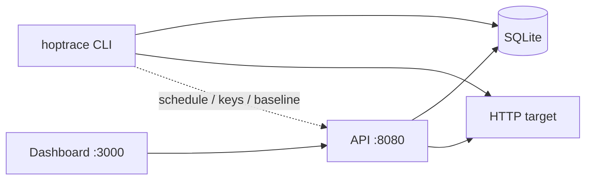

# Hoptrace

HTTP latency profiler — break every request into **DNS → Connect → TLS → Wait → Transfer**.

**Full feature guide (every command, flag, diagram):** **[GUIDE.md](GUIDE.md)**

| Surface | Use |
|---------|-----|
| **CLI** | Fast local probes (`hoptrace <url>`) |
| **Dashboard** | Compose/send requests, waterfall, history, library, share links |

**Local store: SQLite** (`~/.hoptrace/history.db`). No Postgres, Docker, or API keys required to try it.



## Clone and run (local dashboard)

```bash
git clone <repo> && cd hoptrace
pnpm install
make install          # CLI → ~/.local/bin/hoptrace
make dev              # API :8080 + dashboard :3000
hoptrace dashboard    # opens the UI
```

Open [http://127.0.0.1:3000](http://127.0.0.1:3000) — send a request, watch the waterfall, browse history, copy a share link.

Or run pieces separately:

```bash
make api              # :8080 (SQLite, no auth)
make web              # :3000
```

## Install CLI only

```bash
make install
# or after publish:
go install github.com/sandeepv/hoptrace/apps/cli@latest
```

Shell completions: `hoptrace completion zsh` (also bash/fish/powershell).

Tagged releases (`v*`) publish cross-compiled binaries via GitHub Actions. Locally: `make release` → `dist/`.

## CLI (highlights)

```bash
hoptrace 'https://httpbin.io/get'
hoptrace save demo https://httpbin.io/get
hoptrace run demo
hoptrace history
hoptrace history compare <id-a> <id-b>
hoptrace schedule add uptime https://httpbin.io/get --every 60
hoptrace keys create ci
hoptrace baseline 'https://httpbin.io/get'
hoptrace dashboard
hoptrace --slo total=500 'https://httpbin.io/get'
hoptrace --max-body 1048576 'https://example.com/'
```

TTY waterfall uses color phase bars (auto on interactive terminals).  
Force on: `HOPTRACE_COLOR=1` · force off: `NO_COLOR=1`. Add `-v` for probe debug logs.

Single-tenant local tool: one SQLite DB per machine (see [SECURITY.md](SECURITY.md)).

### Exit codes (scripting)

| Code | Meaning |
|------|---------|
| `0` | OK |
| `4` | SLO failed |
| `64` | Usage / bad flags |
| `70` | Software error |
| `75` | Probe / network failure |

CLI and dashboard share the same probe engine and SQLite history.

## Storage

| Mode | Store |
|------|--------|
| **Local (default)** | SQLite — zero setup; powers CLI + dashboard |
| Postgres | Experimental adapter only (`internal/repository/postgres.go`). **Not wired** into the API yet — ignore `DATABASE_URL` for local use |

## Develop

```bash
make test             # go test ./...
pnpm --filter @hoptrace/web typecheck
```

CI runs both on every PR (`.github/workflows/ci.yml`).

## Docs

- **[GUIDE.md](GUIDE.md)** — complete CLI & feature guide (with Mermaid)
- [architecture/](architecture/) — diagrams
- [docs/patterns/](docs/patterns/) — design patterns
- [openapi.yaml](openapi.yaml) — API contract
- [docs/RELEASE.md](docs/RELEASE.md) — release notes
- [SECURITY.md](SECURITY.md) — reporting & local defaults

## License

[Apache-2.0](LICENSE)
